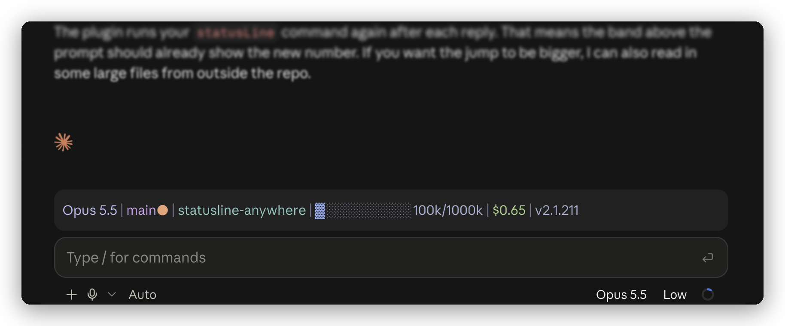

# statusline-anywhere

Your Claude Code status line, in the desktop app too.



<sub>[Catppuccin Frappé](https://statuslin.es/c/catppuccin-frapp-88ba1499) from statuslin.es, running
in Claude Desktop with statusline-anywhere.</sub>

Claude Desktop doesn't draw custom status lines
([#41456](https://github.com/anthropics/claude-code/issues/41456)). This plugin does. It runs the
`statusLine` command you already have and shows the output above the prompt, in color.

## Install

1. Paste this into a terminal:

   ```bash
   claude plugin marketplace add NathanAB/statusline-anywhere && claude plugin install statusline-anywhere@statusline-anywhere
   ```

2. Open a new Code session in Claude Desktop. Your status line is above the prompt.

That's it. You need Claude Code 2.1.286 or later and a status line. No status line yet? Pick one
from [statuslin.es](https://statuslin.es).

<details>
<summary>Install from inside Claude Code instead</summary>

```
/plugin marketplace add NathanAB/statusline-anywhere
/plugin install statusline-anywhere@statusline-anywhere
/reload-plugins
```

</details>

To remove it: `claude plugin uninstall statusline-anywhere@statusline-anywhere`

## How it works

- It runs your `statusLine` command with the same kind of JSON Claude Code sends, so the script you
  already use works as it is.
- It only draws outside the terminal. In a terminal, Claude Code already shows your status line, so
  the plugin stays out of the way.
- It refreshes when a session starts, after each reply, and every 60 seconds, or every
  `refreshInterval` seconds if you set one.

## What your script receives

Claude Code sends status line scripts a JSON object on stdin. statusline-anywhere builds the same
object from what a plugin can see:

- `session_id`
- `transcript_path`
- `cwd`
- `model` (`id`, `display_name`)
- `workspace` (`current_dir`, `project_dir`)
- `version`
- `cost` (`total_cost_usd`, `total_duration_ms`)
- `context_window` (`total_input_tokens`, `context_window_size`, `used_percentage`,
  `remaining_percentage`)
- `exceeds_200k_tokens`
- `rate_limits` (`five_hour`, `seven_day`, `spend_limit`)

A plugin can't see everything Claude Code can. These fields are missing: lines changed, PR, vim
mode, prompt cache, effort and output style. If your status line shows one of them, that part stays
blank in Desktop. Claude Code also leaves out fields it has no value for, so scripts that follow its
docs already handle a missing field.

## What it does on your machine

It runs your status line command as you, which is what Claude Code does with it in a terminal.
Beyond that, it only reads your settings and session info, and draws. The plugin itself makes no
network requests and writes no files.

`claude plugin validate` lists its full footprint: `$.settings.read`, `$.session.*` reads,
`$.env.get` for `HOME` and `CLAUDE_CONFIG_DIR`, `$.process.run`, `$.clock`, and drawing.

## Limits

- **Not on Windows yet.** It runs your command through `sh`.
- **Links aren't clickable.** Links in your status line show as plain text.
- **Another plugin can take the spot.** If a second plugin also draws above the prompt, only one of
  them shows.

## Develop

statusline-anywhere is a [Claude Code mod](https://code.claude.com/docs/en/plugins/mods/overview).
Use Claude Code 2.1.286 or later.

```bash
claude plugin validate .
claude plugin test
```

To try a change in a session, run `claude --plugin-dir .`.

To type-check, load the plugin once with `--plugin-dir` so Claude Code writes its types to
`.claude-plugin/types/`. Then run `npx tsc -p .claude-plugin/types/tsconfig.json`.

## License

MIT. Made by [statuslin.es](https://statuslin.es), the gallery of Claude Code status lines.
