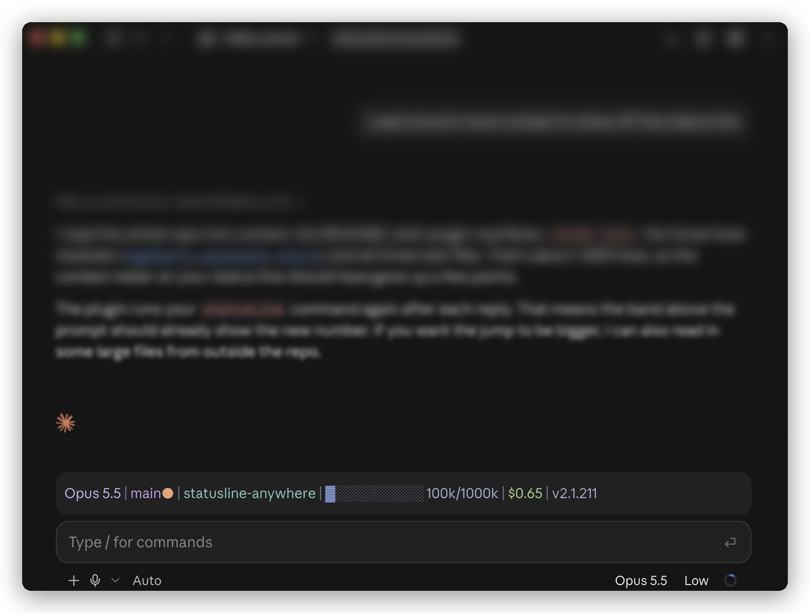

# statusline-anywhere

Your Claude Code status line, in the Claude Desktop app too.



<sub>[Catppuccin Frappé](https://statuslin.es/c/catppuccin-frapp-88ba1499) from statuslin.es, running
in Claude Desktop with statusline-anywhere.</sub>

Claude Code draws your custom status line in the terminal. The Desktop app doesn't, so when you
work there you lose your model, context meter, cost and branch at a glance. Anthropic's issue for
it, [#41456](https://github.com/anthropics/claude-code/issues/41456), has been open since March
2026.

statusline-anywhere runs the `statusLine` command you already have and draws its output, in color,
just above the prompt box.

- **Your status line, as it is.** It reads `statusLine.command` from your settings, so it works with
  the script you already use, including ones from [statuslin.es](https://statuslin.es). There is
  nothing to rewrite.
- **Your terminal stays the same.** Claude Code already draws the status line there, so the plugin
  doesn't run your command or draw anything in a terminal.
- **Up to date.** It reruns your command when a session starts and after each reply. It also reruns
  it every `refreshInterval` seconds if you set one, or every 60 seconds if you don't, so clocks and
  timers keep moving.

## Install

You need Claude Code 2.1.286 or later and a status line already set up. If you don't have one yet,
pick one from [statuslin.es](https://statuslin.es) or see
[Customize your status line](https://code.claude.com/docs/en/statusline).

Then, in Claude Code, either in Desktop's Code tab or a terminal:

```
/plugin marketplace add NathanAB/statusline-anywhere
/plugin install statusline-anywhere@statusline-anywhere
```

Start a new session, or run `/reload-plugins`. Your status line appears above the prompt.

To remove it, run `/plugin`, open the Installed tab, and uninstall statusline-anywhere.

## What your script receives

Claude Code sends status line scripts a JSON object on stdin. statusline-anywhere builds the same
object from what a plugin can see:

- `session_id`
- `transcript_path`
- `cwd`
- `model` (`id`, `display_name`)
- `workspace` (`current_dir`, `project_dir`)
- `version`
- `cost` (`total_cost_usd`, `total_duration_ms`)
- `context_window` (`total_input_tokens`, `context_window_size`, `used_percentage`,
  `remaining_percentage`)
- `exceeds_200k_tokens`
- `rate_limits` (`five_hour`, `seven_day`, `spend_limit`)

A plugin can't see everything Claude Code can. These fields are missing: lines changed, PR, vim
mode, prompt cache, effort and output style. If your status line shows one of them, that part stays
blank in Desktop. Claude Code also leaves out fields it has no value for, so scripts that follow its
docs already handle a missing field.

## What it does on your machine

It runs your status line command as you, which is what Claude Code does with it in a terminal.
Beyond that, it only reads your settings and session info, and draws. The plugin itself makes no
network requests and writes no files.

`claude plugin validate` lists its full footprint: `$.settings.read`, `$.session.*` reads,
`$.env.get` for `HOME` and `CLAUDE_CONFIG_DIR`, `$.process.run`, `$.clock`, and drawing.

## Limits

- **Not on Windows yet.** It runs your command through `sh`.
- **Links aren't clickable.** Links in your status line show as plain text.
- **Another plugin can take the spot.** If a second plugin also draws above the prompt, only one of
  them shows.

## Develop

statusline-anywhere is a [Claude Code mod](https://code.claude.com/docs/en/plugins/mods/overview).
Use Claude Code 2.1.286 or later.

```bash
claude plugin validate .
claude plugin test
```

To try a change in a session, run `claude --plugin-dir .`.

To type-check, load the plugin once with `--plugin-dir` so Claude Code writes its types to
`.claude-plugin/types/`. Then run `npx tsc -p .claude-plugin/types/tsconfig.json`.

## License

MIT. Made by [statuslin.es](https://statuslin.es), the gallery of Claude Code status lines.
